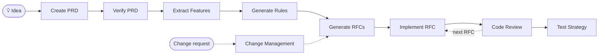

<div align="center">

# 📋 AI PRD Workflow

### RFC-driven development for AI coding agents

**Vague idea → verified PRD → features → rules → sequenced RFCs → reviewed, tested code**

[](LICENSE)
[](CONTRIBUTING.md)
[](https://github.com/nurettincoban/ai-prd-workflow/stargazers)
[](#quick-start)
[](#quick-start)

**[Quick Start](#quick-start)** · **[Workflow](#workflow)** · **[Commands](#available-prompts)** · **[Why RFCs?](#why-rfc-driven-development)** · **[Examples](#examples)**

<sub>RFC-driven since <b>March 2025</b> — before planning modes existed in any AI coding agent.</sub>

</div>

---

A lightweight RFC-driven development workflow for AI coding tools. Ten battle-tested prompts take you from a rough idea to a verified PRD, prioritized features, project rules, and sequenced RFCs — then guide implementation, code review, and testing, one RFC at a time.

Use it two ways:

- **Native slash commands** in Claude Code and Cursor — `/create-prd`, `/implement-rfc 001`, `/workflow-status`, …
- **Copy-paste prompts** into any AI assistant or IDE — ChatGPT, Gemini, Windsurf, Copilot, anything

No CLI to learn, no framework to adopt, no lock-in. Just markdown.

## Quick Start

### Option 1: Install as slash commands (Claude Code & Cursor)

```bash
curl -fsSL https://raw.githubusercontent.com/nurettincoban/ai-prd-workflow/main/install.sh | bash -s -- /path/to/your/project
```

Or from a clone:

```bash
git clone https://github.com/nurettincoban/ai-prd-workflow.git
cd ai-prd-workflow
./install.sh /path/to/your/project            # both tools
./install.sh /path/to/your/project --claude   # Claude Code only
./install.sh /path/to/your/project --cursor   # Cursor only
```

Then open your project and work through the pipeline:

```
/create-prd            # guided interview → PRD.md
/verify-prd            # gap analysis → improved PRD.md
/extract-features      # PRD.md → FEATURES.md (MoSCoW prioritized)
/generate-rules        # → RULES.md (project standards for the AI)
/generate-rfcs         # → RFCs/ folder, in strict implementation order
/implement-rfc 001     # plan → your approval → implementation
/review-rfc 001        # review the implementation against its spec
/test-strategy         # comprehensive test plan
/manage-changes        # requirements changed mid-build? assess impact first
/workflow-status       # lost? see what's done and what's next
```

> [!TIP]
> Cloning this repo and opening it in Claude Code or Cursor gives you the commands immediately — try them against the [example project](examples/url-shortener/).

### Option 2: Copy-paste into any AI assistant

1. Pick a prompt from [Available Prompts](#available-prompts) below
2. Copy its contents (or use `./copy-prompt.sh --list` to browse)
3. Paste into any AI assistant with your project context attached

## Workflow



1. **Create PRD** — Start with a vague idea and develop it into a complete PRD through a guided interview
2. **Verify PRD** — Identify critical gaps and improve quality before anything gets built
3. **Extract Features** — Transform the verified PRD into organized features with priorities and acceptance criteria
4. **Generate Rules** — Establish technical guidelines the AI must follow, wired into your agent config (CLAUDE.md, AGENTS.md, or .cursor/rules/)
5. **Generate RFCs** — Break the project into logical, sequenced implementation units
6. **Implement RFCs** — One RFC at a time: the AI plans first, you approve, then it codes
7. **Code Review** — Review each implementation against its RFC, project rules, security, and performance
8. **Test Strategy** — Generate and execute a comprehensive test plan

When requirements change mid-development, run **Change Management** to assess impact before touching the docs, then continue. Run **Workflow Status** anytime to see where you are and what's next.

## Available Prompts

| Command | Prompt | Description |
|---------|--------|-------------|
| `/create-prd` | [Interactive PRD Creation](interactive-prd-creation-prompt.md) | Create a PRD through a guided step-by-step questioning process |
| `/verify-prd` | [PRD Comprehensive Verification](prd-comprehensive-verification-prompt.md) | Verify and improve your PRD by identifying gaps and quality issues |
| `/extract-features` | [PRD to Features](prd-to-features-prompt.md) | Extract and organize features with MoSCoW prioritization |
| `/generate-rules` | [PRD to Rules](prd-to-rules-prompt.md) | Generate technical guidelines and standards for development |
| `/generate-rfcs` | [PRD to RFCs](prd-to-rfcs-prompt.md) | Break down your PRD into sequenced implementation units |
| `/implement-rfc <id>` | [Implementation Template](implementation-prompt-template.md) | Implement a single RFC — plan first, code after approval |
| `/review-rfc <id>` | [Code Review](code-review-prompt.md) | Review an implementation against RFC, rules, security, performance |
| `/test-strategy` | [Testing Strategy](testing-strategy-prompt.md) | Generate a comprehensive test plan from features and RFCs |
| `/manage-changes` | [PRD Change Management](prd-change-management-prompt.md) | Assess and integrate requirement changes mid-development |
| `/workflow-status` | [Workflow Status](workflow-status-prompt.md) | See which artifacts exist, detect drift, get the next step |

## Why RFC-driven development?

AI coding agents are strong enough now to build entire features unsupervised — which makes *what you ask for* the bottleneck, not the code. If you've heard of spec-driven development (GitHub Spec Kit, Amazon Kiro), this is the same philosophy — and this workflow predates both — with sequenced RFCs as the unit of work and no framework or CLI to adopt. Structured specs fix the real problems:

- **Clearer instructions, fewer hallucinations** — a PRD and RFCs give the AI precise context and boundaries instead of letting it fill gaps with assumptions
- **Scope control** — explicitly defined in/out of scope prevents the agent from implementing features nobody asked for
- **Incremental verification** — sequenced RFCs let you validate at each step instead of reviewing a 5,000-line diff at the end
- **Context that fits** — focused RFCs work within context limits far better than "here's my whole idea, build it"
- **Traceability & knowledge preservation** — every implementation traces to a requirement, and the docs outlive any one chat session, team member, or model
- **Shared mental model** — business stakeholders, developers, and AI tools all work from the same documents

## "Doesn't my coding agent already plan?"

Yes — tactically. This workflow shipped in March 2025, before planning modes existed in any AI coding agent, and it solves a different problem than they do:

| Built-in plan mode | This workflow |
|---|---|
| Plans **one task** — "how do I implement this?" | Plans **the product** — what are we building, for whom, what's out of scope? |
| Plan dies with the session | PRD, features, rules, and RFCs persist across sessions, models, tools, and teammates |
| Takes your request at face value | `/create-prd` interviews you first — decisions leave your head before code exists |
| Reviews code by "looks right" | `/review-rfc` verifies against written acceptance criteria; `/workflow-status` catches drift |

The two compose rather than compete: `/generate-rfcs` decides **what** the next unit of work is, and each `/implement-rfc` hands your agent's planner a well-scoped, context-sized task — exactly what plan mode is good at.

**Sweet spot:** greenfield products, multi-week builds, and anyone building something real with AI — where scope creep and forgotten decisions, not code quality, are what kill the project. For a small fix in an existing codebase, your agent alone is fine. For everything bigger, write the spec first.

## Examples

The [examples/url-shortener](examples/url-shortener/) folder contains complete sample outputs for each step of the workflow:

- [PRD](examples/url-shortener/PRD.md) — Product Requirements Document
- [Features](examples/url-shortener/FEATURES.md) — Extracted features with MoSCoW prioritization
- [Rules](examples/url-shortener/RULES.md) — Development standards and guidelines
- [RFCs](examples/url-shortener/RFCs/) — Implementation units (3 RFCs)

## Compatibility

The prompts are plain markdown and work with any modern LLM:

- **Claude** (Anthropic) — Claude 4 and Claude 5 families
- **GPT** (OpenAI) — GPT-4o, GPT-5 family
- **Gemini** (Google) — Gemini 2.5 and later
- **Open models** — Llama, Mistral, Qwen, DeepSeek (with sufficient context)

Tool support:

- **Native slash commands**: Claude Code, Cursor (via `install.sh`)
- **Copy-paste**: Windsurf, GitHub Copilot, Codex CLI, Cline, Aider, or any chat interface (manually or via `./copy-prompt.sh <prompt-file>`)

## Quick Tips

- Provide complete documents when possible and answer the AI's clarifying questions
- Review and customize AI outputs before implementation — the approval gate in `/implement-rfc` exists for a reason
- Implement RFCs strictly in order; each builds on the previous ones
- Keep RULES.md referenced from your agent config so standards stay in context

## Contributing

See [CONTRIBUTING.md](CONTRIBUTING.md) for guidelines on submitting new prompts, quality standards, and testing approach.

## License

This project is licensed under the MIT License — see the [LICENSE](LICENSE) file for details.

---

<p align="center">Made with care for better product development with AI.<br>If this workflow saves you time, a ⭐ helps others find it.</p>
